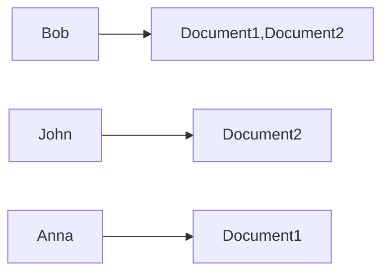

[Computer science](/engineering/computer-science)
# Inverted index

### Definition

***Inverted index*** is a data structure mainly used for full-text search (by engines like Lucene, used by Elasticsearch). With inverted index we get a dictionary of `word -> document`, so that we know which document contains which term when searching.
The name inverted index comes from how they way it is structured when compared to *forward index*, which is `document -> words` structure.

Inverted index for words/terms = `[Bob, John, Anna]` present in documents = `[Document1, Document2]` can be presented this way:

### Index lookup

 Since inverted indices are sorted by default, finding documents that contain a term 'XYZ' or prefixed with it are ~ `O(log(n))`. 
 
 The problem is - sometimes we'd like to also know which document contains part of a term. Without some tricks we'd end up with `O(n)` time complexity, since we'd have to browse whole index.

 However we can "hack around" this problem with several approaches:
 - **indexing reverse terms**, which effectively allows us to find words that "end with phrase X", not "start with phrase X",
 - splitting indexed terms/tokens into parts with **n-grams** (every possible subwords of given words) or **edge n-grams** (every possible subword anchored to start of the word) 

and many more, that is managed by engines like Lucene itself.

There are also problems with matching words like:
- *typos*, so we might need to introduce text similarity detection algorithms based on **Levenshtein distance**
- matching results based on their *phonetical representation* with algorithms like **Metaphone**

### Stemming

When document is added to inverted index, we need to add every term/word that is present in document so that it's efficiently searachable via this index.
However, many words are variations of "core" term, so they can be stored under one entry for both space and lookup speed efficiency.

For example core term "like" can be a result of stemming terms like "like", "likes", "likely", "liked" etc.

Popular algorithm used for stemming is *Porter Stemmer algorithm*.

 ### Sources
 - https://www.elastic.co/blog/found-indexing-for-beginners-part3
 - https://www.geeksforgeeks.org/inverted-index/ 
 - https://iq.opengenus.org/porter-stemmer/ 
 - https://www.elastic.co/blog/found-elasticsearch-from-the-bottom-up 