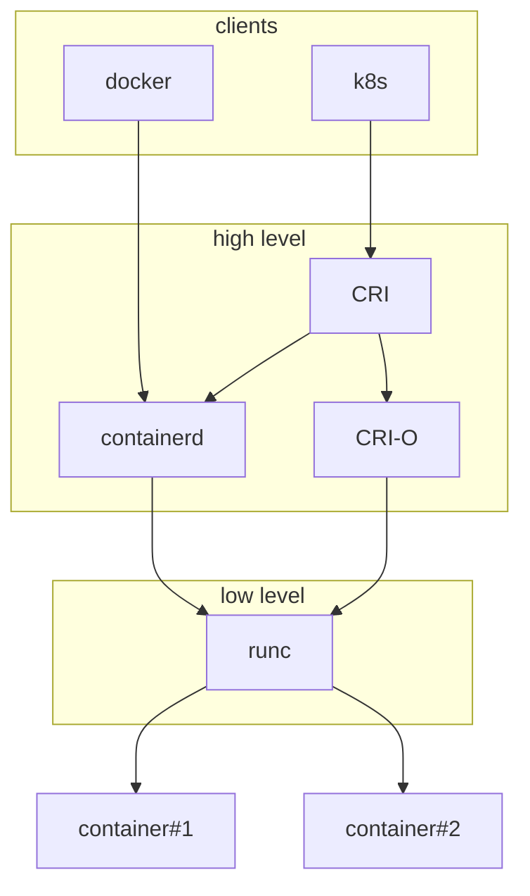

[Operating systems](/engineering/operating-systems)
# Container runtime

## Container

Containers are a de facto standard on how we define, package, deploy and run applications nowadays. They allow definining dependencies through the layers that does not need to present before actually deploying an app (ie. we do not have to prepare it beforhand like we used to do).
 They also offer isolation, security and resource (CPU, RAM, I/O, network) utilization limits like virtual machines do but with much better hardware utilisation (often characterized as being "lightweight"). Isolation is achieved with Linux `namespaces` and resource limiting is achieved with Linux `cgroups`. Being lightweight is achieved by sharing host's OS kernel between containers.

Since maintaining all of the namespace and cgroups configuration for each container would be a pain, **container runtimes** have been introduced to automate this away.

## Container runtime building blocks

Container ecosystem from developer perspective might be pretty obvious through tools like Docker (`docker-cli`) for development and Kubernetes for running in production. But how do these things run behind the scenes?  First of all, back in old times Docker was a monolithic engine and that's what Kubernetes used.  With growing popularity of containers, things like container runtime (how to run containers) or specification of container image, its env and lifecycle were abstracted away. 

They came in a form of `CRI` (**Container Runtime Interface**) which is a Kubernetes API for communicating with underlying runtime (that's what `kubelet` uses as a "contract"). 
 Most popular implementations of CRI are `containerd` (which is also used by Docker) and `cri-o`. CRI implementations are often called "high-level runtimes", since they are delegating actual "container running" to OCI-based (**Open Container Initiative** Runtime Spec), "low-level/native runtimes" like model implementation of OCI standard: `runc`.

Last one thing worth noting is that "Docker containers" as we're used to call them are actually (for a few years already) OCI-compliant images, at least that's what all of the images must be compatible with.

## How it all fits together

*(loosely based on Tutorial Works article)*